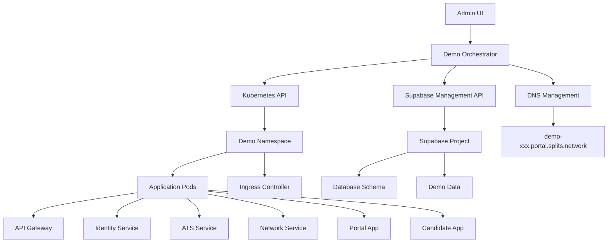
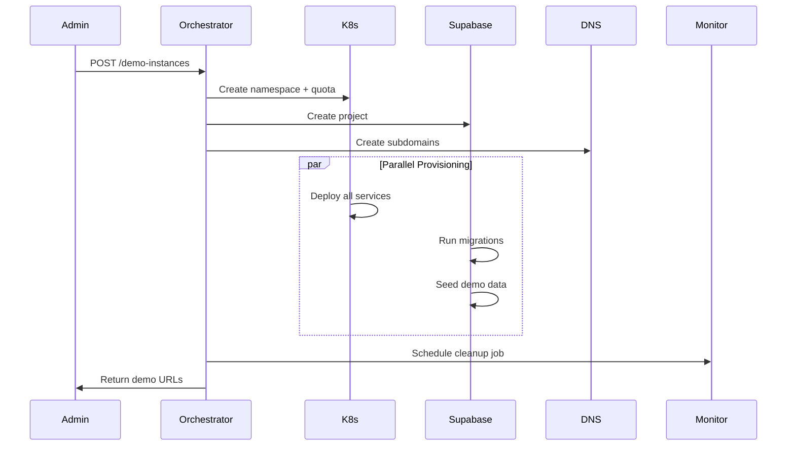

# Demo Environment Architecture

> **🏗️ Technical architecture for the Demo Environment Orchestration System**

This document details the technical architecture and implementation patterns for creating on-demand, isolated demo environments of the Splits Network platform.

## 🌐 System Overview



## 🧩 Core Components

### 1. Demo Orchestrator Service

**Location**: `services/demo-orchestrator/`

**Responsibilities**:

- Demo instance lifecycle management
- Kubernetes resource provisioning
- Supabase project coordination
- DNS configuration
- Auto-cleanup scheduling

**Key Interface**:

```typescript
interface DemoOrchestrator {
    createInstance(config: DemoConfig): Promise<DemoInstance>;
    deleteInstance(instanceId: string): Promise<void>;
    extendInstance(instanceId: string, hours: number): Promise<void>;
    listInstances(): Promise<DemoInstance[]>;
    getInstanceStatus(instanceId: string): Promise<DemoStatus>;
}

interface DemoInstance {
    id: string; // demo-abc123
    namespace: string; // k8s namespace
    urls: {
        portal: string; // https://demo-abc123.portal.splits.network
        candidate: string; // https://demo-abc123.candidate.splits.network
    };
    supabase: {
        url: string;
        anonKey: string;
    };
    status: "creating" | "ready" | "destroying";
    expiresAt: Date;
    createdBy: string;
}
```

**Database Schema**:

```sql
CREATE TABLE demo_instances (
  id VARCHAR(32) PRIMARY KEY,          -- demo-abc123
  namespace VARCHAR(64) NOT NULL,      -- k8s namespace
  supabase_project_id VARCHAR(64),     -- Supabase project ref
  demo_type VARCHAR(32) NOT NULL,      -- recruiting-agency, enterprise, startup
  status VARCHAR(16) NOT NULL,         -- creating, ready, destroying, failed
  portal_url TEXT NOT NULL,            -- https://demo-abc123.portal.splits.network
  candidate_url TEXT NOT NULL,        -- https://demo-abc123.candidate.splits.network
  created_at TIMESTAMPTZ DEFAULT NOW(),
  expires_at TIMESTAMPTZ NOT NULL,
  created_by VARCHAR(64) NOT NULL,     -- Admin user ID
  metadata JSONB DEFAULT '{}'
);

CREATE INDEX idx_demo_instances_status ON demo_instances(status);
CREATE INDEX idx_demo_instances_expires ON demo_instances(expires_at);
```

### 2. Data Flow Architecture



### 3. Service Integration Points

**Demo Mode Configuration**:

```typescript
// Environment configuration for demo instances
interface DemoConfig {
    instanceId: string;
    demoType: "recruiting-agency" | "enterprise" | "startup";
    supabaseUrl: string;
    supabaseAnonKey: string;
    clerkPublishableKey: string; // Demo-specific Clerk app
    demoMode: true;
    autoCleanup: true;
    maxDuration: number; // hours
}

// Service configuration generator
function generateServiceConfig(baseConfig: DemoConfig): Record<string, string> {
    return {
        DEMO_MODE: "true",
        DEMO_INSTANCE_ID: baseConfig.instanceId,
        SUPABASE_URL: baseConfig.supabaseUrl,
        SUPABASE_ANON_KEY: baseConfig.supabaseAnonKey,
        CLERK_PUBLISHABLE_KEY: baseConfig.clerkPublishableKey,
        NODE_ENV: "demo",
        LOG_LEVEL: "info",
        // Disable external integrations in demo mode
        STRIPE_WEBHOOK_ENABLED: "false",
        RESEND_ENABLED: "false",
        WEBHOOKS_ENABLED: "false",
    };
}
```

## 🔧 Technology Stack

### Infrastructure Layer

- **Kubernetes**: Container orchestration and resource management
- **Nginx Ingress**: Load balancing and SSL termination
- **Cloudflare DNS**: Dynamic subdomain management
- **Helm**: Application deployment templating

### Data Layer

- **Supabase**: Isolated database projects per demo
- **PostgreSQL**: Primary database engine
- **Redis**: Session and cache storage
- **RabbitMQ**: Event-driven communication

### Application Layer

- **Next.js 16**: Portal and candidate applications
- **Fastify**: Backend API services
- **TypeScript**: Type-safe development
- **Docker**: Containerization

### External Services

- **Clerk**: Authentication (demo-specific apps)
- **Supabase Management API**: Project automation
- **Cloudflare API**: DNS automation

## 📊 Scalability Considerations

### Resource Allocation Strategy

**Small Demo (Default)**:

- CPU: 2 cores total across all services
- Memory: 4GB total
- Pods: ≤20 per namespace
- Duration: 2 hours default, 8 hours max

**Load Testing Demo**:

- CPU: 4 cores total
- Memory: 8GB total
- Extended duration: 24 hours
- Performance monitoring enabled

### Cluster Capacity Planning

```typescript
// Cluster resource calculator
interface ClusterCapacity {
    totalCPU: number;
    totalMemory: number;
    reservedForProduction: number; // percentage
    maxConcurrentDemos: number;
}

function calculateMaxDemos(capacity: ClusterCapacity): number {
    const availableCPU =
        capacity.totalCPU * (1 - capacity.reservedForProduction / 100);
    const availableMemory =
        capacity.totalMemory * (1 - capacity.reservedForProduction / 100);

    const demosFromCPU = Math.floor(availableCPU / DEMO_CPU_REQUIREMENT);
    const demosFromMemory = Math.floor(
        availableMemory / DEMO_MEMORY_REQUIREMENT,
    );

    return Math.min(demosFromCPU, demosFromMemory, capacity.maxConcurrentDemos);
}
```

## 🔍 Monitoring & Observability

### Health Check System

```typescript
interface DemoStatus {
    instance_id: string;
    status: "creating" | "ready" | "degraded" | "destroying" | "failed";
    health_checks: {
        kubernetes: "healthy" | "unhealthy";
        supabase: "healthy" | "unhealthy";
        portal: "healthy" | "unhealthy";
        candidate: "healthy" | "unhealthy";
        api_gateway: "healthy" | "unhealthy";
    };
    resource_usage: {
        cpu_usage: number; // percentage
        memory_usage: number; // percentage
        pod_count: number;
    };
    created_at: string;
    expires_at: string;
    last_accessed: string;
}
```

### Metrics Collection

- **Prometheus**: Resource and performance metrics
- **Grafana**: Demo environment dashboards
- **Application logs**: Centralized logging per demo
- **Usage analytics**: Demo session tracking

## 🔄 Future Architecture Enhancements

### Phase 2: Advanced Features

- **Template marketplace**: Industry-specific demo scenarios
- **Multi-region support**: Global demo deployment
- **Advanced networking**: Service mesh integration
- **Persistent demo storage**: Optional data persistence

### Phase 3: Enterprise Features

- **White-label demos**: Customer-branded environments
- **API integrations**: CRM and sales tool integration
- **Advanced analytics**: Detailed usage reporting
- **Compliance features**: SOC2/GDPR considerations

---

This architecture provides a robust foundation for scalable demo environment provisioning while maintaining strong isolation and resource efficiency.
