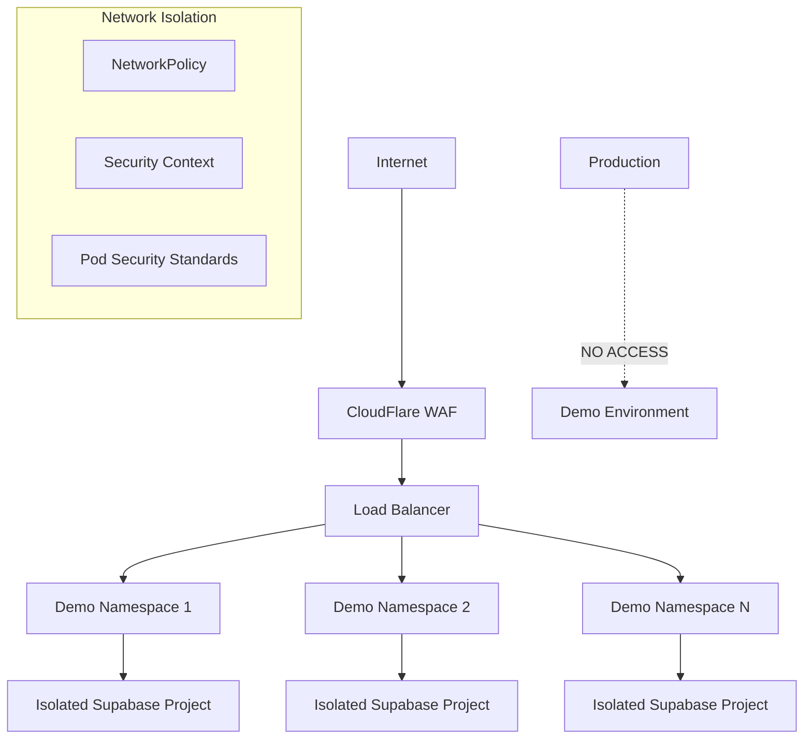

# Demo Environment Security

> **🔒 Security architecture and isolation for demo environments**

This document outlines security measures, isolation strategies, and compliance considerations for the demo environment system.

## 🎯 Security Goals

### Core Security Principles

- **Complete Isolation**: Demo environments cannot access production data or systems
- **Data Protection**: Demo data is synthetic and cannot contain real customer information
- **Network Segmentation**: Isolated network policies prevent cross-instance communication
- **Time-bound Access**: All demo instances have strict expiration times
- **Audit Trail**: All activities are logged and monitored

### Threat Model

- **Internal misuse**: Employees accessing production data via demo
- **Data leakage**: Real customer data appearing in demo environments
- **Resource hijacking**: Demo instances being used for non-demo purposes
- **Cross-tenant access**: Demo users accessing other demo instances
- **Privilege escalation**: Demo users gaining unauthorized system access

## 🏗️ Security Architecture

### Multi-Layer Isolation



### Security Boundaries

1. **Infrastructure Level** (Kubernetes)
    - Isolated namespaces with strict RBAC
    - Network policies blocking cross-namespace traffic
    - Resource quotas preventing resource exhaustion
    - Pod security standards enforcing baseline security

2. **Application Level** (Services)
    - Separate Supabase projects (complete database isolation)
    - Demo-specific authentication keys
    - Readonly access to shared resources
    - Synthetic data only

3. **Network Level** (Networking)
    - DNS subdomain isolation
    - TLS termination at ingress
    - Firewall rules blocking production access
    - Rate limiting per demo instance

## 🛡️ Kubernetes Security Configuration

### Namespace Security Policy

```yaml
# Namespace with security labels
apiVersion: v1
kind: Namespace
metadata:
    name: demo-{{INSTANCE_ID}}
    labels:
        app: splits-demo
        security.splits.network/isolation-level: "strict"
        security.splits.network/data-classification: "synthetic"
        # Pod Security Standards
        pod-security.kubernetes.io/enforce: restricted
        pod-security.kubernetes.io/audit: restricted
        pod-security.kubernetes.io/warn: restricted
    annotations:
        security.splits.network/expires-at: "{{EXPIRES_AT}}"
        security.splits.network/owner: "{{CREATED_BY}}"
```

### Network Security Policies

```yaml
# Complete network isolation
apiVersion: networking.k8s.io/v1
kind: NetworkPolicy
metadata:
    name: demo-isolation
    namespace: demo-{{INSTANCE_ID}}
spec:
    podSelector: {}
    policyTypes:
        - Ingress
        - Egress

    # Ingress: Only from ingress controller
    ingress:
        - from:
              - namespaceSelector:
                    matchLabels:
                        name: ingress-nginx
          ports:
              - protocol: TCP
                port: 3000

    # Egress: Controlled external access only
    egress:
        # DNS resolution
        - to: []
          ports:
              - protocol: UDP
                port: 53
              - protocol: TCP
                port: 53

        # HTTPS to external services (Supabase, Clerk)
        - to: []
          ports:
              - protocol: TCP
                port: 443

    # Block all other traffic (including production namespaces)
---
# Additional policy: Block access to Kubernetes API
apiVersion: networking.k8s.io/v1
kind: NetworkPolicy
metadata:
    name: block-kubernetes-api
    namespace: demo-{{INSTANCE_ID}}
spec:
    podSelector: {}
    policyTypes:
        - Egress
    egress:
        - to:
              - namespaceSelector:
                    matchExpressions:
                        - key: name
                          operator: NotIn
                          values: ["kube-system", "kube-public"]
```

### Pod Security Standards

```yaml
# Security context for all demo pods
apiVersion: v1
kind: Pod
spec:
    securityContext:
        # Run as non-root
        runAsNonRoot: true
        runAsUser: 1001
        runAsGroup: 1001
        fsGroup: 1001

        # Security enhancements
        seccompProfile:
            type: RuntimeDefault

    containers:
        - name: app
          securityContext:
              # Prevent privilege escalation
              allowPrivilegeEscalation: false
              privileged: false

              # Drop all capabilities
              capabilities:
                  drop:
                      - ALL

              # Read-only root filesystem
              readOnlyRootFilesystem: true

              # Resource limits (security via resource control)
              resources:
                  limits:
                      cpu: 500m
                      memory: 512Mi
                  requests:
                      cpu: 100m
                      memory: 128Mi

          # Minimal writable volumes
          volumeMounts:
              - name: tmp
                mountPath: /tmp
              - name: var-cache
                mountPath: /var/cache

    volumes:
        - name: tmp
          emptyDir:
              sizeLimit: 100Mi
        - name: var-cache
          emptyDir:
              sizeLimit: 50Mi
```

### RBAC Configuration

```yaml
# Minimal service account for demo pods
apiVersion: v1
kind: ServiceAccount
metadata:
  name: demo-service-account
  namespace: demo-{{INSTANCE_ID}}
automountServiceAccountToken: false  # No K8s API access
---
# Role with minimal permissions
apiVersion: rbac.authorization.k8s.io/v1
kind: Role
metadata:
  namespace: demo-{{INSTANCE_ID}}
  name: demo-pod-role
rules:
# No permissions - demo pods should not access K8s API
[]
---
# Bind service account to minimal role
apiVersion: rbac.authorization.k8s.io/v1
kind: RoleBinding
metadata:
  name: demo-pod-binding
  namespace: demo-{{INSTANCE_ID}}
subjects:
- kind: ServiceAccount
  name: demo-service-account
  namespace: demo-{{INSTANCE_ID}}
roleRef:
  kind: Role
  name: demo-pod-role
  apiGroup: rbac.authorization.k8s.io
```

## 🗄️ Data Security

### Synthetic Data Generation

```typescript
class SecureDemoDataGenerator {
    private readonly PROHIBITED_DOMAINS = [
        "@splits.network",
        "@acme.com", // Real customer domains
        "@enterprise.com",
    ];

    async generateSyntheticUser(): Promise<DemoUser> {
        // Generate completely fake data
        const firstName = faker.person.firstName();
        const lastName = faker.person.lastName();
        const emailDomain = faker.internet.domainName();

        // Ensure no real email addresses
        const email = `${firstName.toLowerCase()}.${lastName.toLowerCase()}@demo-${emailDomain}`;

        // Validate against prohibited patterns
        this.validateSyntheticData({ email, firstName, lastName });

        return {
            id: `demo_${crypto.randomUUID()}`,
            email,
            firstName,
            lastName,
            phone: this.generateFakePhone(),
            address: this.generateFakeAddress(),
            // Mark as synthetic
            metadata: {
                synthetic: true,
                generated_at: new Date().toISOString(),
                generator_version: "1.0.0",
            },
        };
    }

    private validateSyntheticData(data: any): void {
        // Ensure no real data patterns
        const email = data.email?.toLowerCase() || "";

        for (const domain of this.PROHIBITED_DOMAINS) {
            if (email.includes(domain)) {
                throw new Error(`Prohibited domain detected: ${domain}`);
            }
        }

        // Ensure demo prefix
        if (!email.includes("@demo-")) {
            throw new Error("Email must use demo domain prefix");
        }

        // Additional validation rules...
    }
}
```

### Data Isolation Validation

```typescript
class DataSecurityValidator {
    async validateDemoDataIsolation(
        instanceId: string,
    ): Promise<SecurityValidationResult> {
        const violations: SecurityViolation[] = [];

        // 1. Check for real email addresses
        const realEmails = await this.checkForRealEmailAddresses(instanceId);
        if (realEmails.length > 0) {
            violations.push({
                type: "real_data_found",
                severity: "critical",
                description: "Real email addresses found in demo data",
                details: realEmails,
            });
        }

        // 2. Check for production data references
        const prodRefs = await this.checkForProductionReferences(instanceId);
        if (prodRefs.length > 0) {
            violations.push({
                type: "production_data_reference",
                severity: "high",
                description: "References to production data found",
                details: prodRefs,
            });
        }

        // 3. Validate numeric patterns (SSNs, phone numbers)
        const suspiciousNumbers =
            await this.validateNumericPatterns(instanceId);
        if (suspiciousNumbers.length > 0) {
            violations.push({
                type: "suspicious_numbers",
                severity: "medium",
                description: "Potentially real numeric data found",
                details: suspiciousNumbers,
            });
        }

        return {
            instanceId,
            timestamp: new Date().toISOString(),
            passed: violations.length === 0,
            violations,
        };
    }

    private async checkForRealEmailAddresses(
        instanceId: string,
    ): Promise<string[]> {
        const supabase = this.getDemoSupabaseClient(instanceId);

        const { data } = await supabase
            .from("users")
            .select("email")
            .not("email", "like", "%@demo-%")
            .not("metadata->>synthetic", "eq", "true");

        return data?.map((u) => u.email) || [];
    }
}
```

## 🔐 Access Control & Authentication

### Demo-Specific Authentication

```typescript
class DemoAuthManager {
    async createDemoAuthConfiguration(
        instanceId: string,
    ): Promise<DemoAuthConfig> {
        // Create isolated Clerk application for demo
        const clerkApp = await this.clerkManagement.createApplication({
            name: `Splits Demo ${instanceId}`,
            environment: "demo",
            settings: {
                // Restricted settings for demos
                session_lifetime: "2h", // Match demo duration
                password_complexity: "low",
                allow_sign_ups: true,
                require_email_verification: false, // Speed up demo flow

                // Demo-specific redirects
                allowed_origins: [
                    `https://portal-${instanceId}.demo.splits.network`,
                    `https://candidate-${instanceId}.demo.splits.network`,
                ],
            },
        });

        return {
            clerk_publishable_key: clerkApp.publishable_key,
            clerk_secret_key: clerkApp.secret_key,
            jwt_issuer: clerkApp.issuer_url,
            instance_id: instanceId,
        };
    }

    async seedDemoUsers(
        instanceId: string,
        authConfig: DemoAuthConfig,
    ): Promise<DemoCredentials[]> {
        const credentials: DemoCredentials[] = [];

        // Create demo users with known passwords
        const demoUsers = [
            {
                email: "admin@demo-acme.com",
                role: "company_admin",
                password: "Demo123!",
            },
            {
                email: "recruiter@demo-talent.com",
                role: "recruiter",
                password: "Demo123!",
            },
            {
                email: "candidate@demo-email.com",
                role: "candidate",
                password: "Demo123!",
            },
        ];

        for (const user of demoUsers) {
            const clerkUser = await this.clerkClient.createUser({
                email_address: [user.email],
                password: user.password,
                skip_password_checks: true, // Demo-only setting
                created_at: new Date(),
            });

            // Link to internal user record
            await this.createDemoUserRecord(instanceId, clerkUser.id, user);

            credentials.push({
                email: user.email,
                password: user.password,
                role: user.role,
                clerk_user_id: clerkUser.id,
            });
        }

        return credentials;
    }
}
```

### Session Security

```typescript
// Demo-specific session configuration
const demoSessionConfig = {
    // Shorter session duration
    maxAge: 2 * 60 * 60 * 1000, // 2 hours (match demo duration)

    // Demo-specific cookie settings
    cookie: {
        name: `splits_demo_${instanceId}`,
        domain: `.demo.splits.network`,
        secure: true,
        httpOnly: true,
        sameSite: "strict",
    },

    // Enhanced monitoring for demos
    logging: {
        auth_events: true,
        session_events: true,
        access_attempts: true,
    },

    // Auto-logout before demo expiration
    warningTime: 15 * 60 * 1000, // 15 minutes before expiration
    forceLogout: true,
};
```

## 🔍 Security Monitoring

### Real-time Security Monitoring

```typescript
class DemoSecurityMonitor {
    private alerts = [
        "unauthorized_api_access",
        "cross_namespace_traffic",
        "resource_limit_exceeded",
        "suspicious_data_access",
        "failed_authentication_spike",
        "demo_expiration_ignored",
    ];

    async monitorSecurityEvents(instanceId: string): Promise<void> {
        // Set up monitoring for various security events
        await Promise.all([
            this.monitorNetworkTraffic(instanceId),
            this.monitorDataAccess(instanceId),
            this.monitorResourceUsage(instanceId),
            this.monitorAuthenticationEvents(instanceId),
        ]);
    }

    private async monitorNetworkTraffic(instanceId: string): Promise<void> {
        const namespace = `demo-${instanceId}`;

        // Monitor for traffic to production namespaces
        const networkEvents = await this.k8s.watchNetworkEvents(namespace);

        networkEvents.on("blocked_traffic", (event) => {
            this.alertManager.sendAlert({
                type: "cross_namespace_traffic_attempt",
                severity: "high",
                instance_id: instanceId,
                details: event,
                message:
                    "Demo instance attempted to access restricted network resources",
            });
        });
    }

    private async monitorDataAccess(instanceId: string): Promise<void> {
        const supabase = this.getDemoSupabaseClient(instanceId);

        // Monitor for suspicious query patterns
        supabase.on("query", (query) => {
            if (this.isSuspiciousQuery(query)) {
                this.alertManager.sendAlert({
                    type: "suspicious_data_access",
                    severity: "medium",
                    instance_id: instanceId,
                    details: { query: this.sanitizeQuery(query) },
                    message: "Suspicious data access pattern detected",
                });
            }
        });
    }

    private isSuspiciousQuery(query: any): boolean {
        // Detect attempts to access system tables or escape demo schema
        const suspiciousPatterns = [
            /information_schema/i,
            /pg_catalog/i,
            /\bpublic\b/i, // Default schema
            /\bproduction\b/i,
            /\bdrop\s+/i,
            /\bdelete\s+from\b/i, // Unusual for demo usage
        ];

        return suspiciousPatterns.some((pattern) =>
            pattern.test(query.sql || ""),
        );
    }
}
```

### Audit Logging

```typescript
interface DemoAuditEvent {
    timestamp: string;
    instance_id: string;
    user_id?: string;
    event_type:
        | "authentication"
        | "data_access"
        | "resource_usage"
        | "security_violation";
    action: string;
    resource?: string;
    metadata?: Record<string, any>;
    source_ip?: string;
    user_agent?: string;
}

class DemoAuditLogger {
    async logEvent(event: Omit<DemoAuditEvent, "timestamp">): Promise<void> {
        const auditEvent: DemoAuditEvent = {
            ...event,
            timestamp: new Date().toISOString(),
        };

        // Store in secure audit database
        await this.auditDatabase.insert("demo_audit_events", auditEvent);

        // Stream to security monitoring system
        await this.securityStream.publish("demo.audit", auditEvent);

        // Check for immediate security concerns
        await this.evaluateSecurityEvent(auditEvent);
    }

    async getDemoAuditTrail(instanceId: string): Promise<DemoAuditEvent[]> {
        return await this.auditDatabase
            .select("*")
            .from("demo_audit_events")
            .where("instance_id", instanceId)
            .orderBy("timestamp", "asc");
    }
}
```

## 🔒 Secrets Management

### Demo-Specific Secret Management

```yaml
# Demo instance secrets template
apiVersion: v1
kind: Secret
metadata:
    name: demo-secrets
    namespace: demo-{{INSTANCE_ID}}
    labels:
        app: splits-demo
        instance: "{{INSTANCE_ID}}"
type: Opaque
data:
    # Supabase configuration (base64 encoded)
    SUPABASE_URL: { { SUPABASE_URL_B64 } }
    SUPABASE_ANON_KEY: { { SUPABASE_ANON_KEY_B64 } }
    SUPABASE_SERVICE_ROLE_KEY: { { SUPABASE_SERVICE_ROLE_KEY_B64 } }

    # Clerk configuration (demo-specific keys)
    NEXT_PUBLIC_CLERK_PUBLISHABLE_KEY: { { CLERK_PUBLISHABLE_KEY_B64 } }
    CLERK_SECRET_KEY: { { CLERK_SECRET_KEY_B64 } }
    CLERK_WEBHOOK_SECRET: { { CLERK_WEBHOOK_SECRET_B64 } }

    # Demo-specific configuration
    DEMO_MODE: dHJ1ZQ== # "true" in base64
    DEMO_INSTANCE_ID: { { INSTANCE_ID_B64 } }
    DEMO_EXPIRES_AT: { { EXPIRES_AT_B64 } }
```

### Secret Rotation for Demo Instances

```typescript
class DemoSecretManager {
    async rotateDemoSecrets(instanceId: string): Promise<void> {
        // Generate new demo-specific keys
        const newSecrets = await this.generateDemoSecrets(instanceId);

        // Update Kubernetes secrets
        await this.k8s.patchSecret(
            `demo-${instanceId}`,
            "demo-secrets",
            newSecrets,
        );

        // Trigger rolling restart of services
        await this.triggerServiceRestart(instanceId);

        // Audit secret rotation
        await this.auditLogger.logEvent({
            instance_id: instanceId,
            event_type: "security_violation",
            action: "secrets_rotated",
            metadata: { reason: "scheduled_rotation" },
        });
    }

    private async generateDemoSecrets(
        instanceId: string,
    ): Promise<Record<string, string>> {
        // Generate time-limited, instance-specific secrets
        const secrets = {
            jwt_secret: crypto.randomBytes(32).toString("hex"),
            api_key: `demo_${instanceId}_${crypto.randomBytes(16).toString("hex")}`,
            webhook_secret: crypto.randomBytes(24).toString("hex"),
        };

        // Store secret metadata for tracking
        await this.secretRegistry.register(instanceId, {
            generated_at: new Date(),
            expires_at: this.calculateExpirationTime(instanceId),
            secret_ids: Object.keys(secrets),
        });

        return secrets;
    }
}
```

## ✅ Compliance & Governance

### Security Compliance Checklist

```typescript
interface ComplianceCheck {
    check_id: string;
    description: string;
    status: "pass" | "fail" | "warning";
    details?: string;
    remediation?: string;
}

class DemoComplianceValidator {
    async validateCompliance(instanceId: string): Promise<ComplianceCheck[]> {
        const checks: ComplianceCheck[] = [];

        // 1. Data isolation validation
        checks.push(await this.validateDataIsolation(instanceId));

        // 2. Network segmentation validation
        checks.push(await this.validateNetworkSegmentation(instanceId));

        // 3. Access control validation
        checks.push(await this.validateAccessControls(instanceId));

        // 4. Audit logging validation
        checks.push(await this.validateAuditLogging(instanceId));

        // 5. Secret management validation
        checks.push(await this.validateSecretManagement(instanceId));

        // 6. Resource limit validation
        checks.push(await this.validateResourceLimits(instanceId));

        return checks;
    }

    private async validateDataIsolation(
        instanceId: string,
    ): Promise<ComplianceCheck> {
        try {
            const validation =
                await this.dataSecurityValidator.validateDemoDataIsolation(
                    instanceId,
                );

            return {
                check_id: "data_isolation",
                description:
                    "Verify demo data contains no real customer information",
                status: validation.passed ? "pass" : "fail",
                details:
                    validation.violations.length > 0
                        ? `Found ${validation.violations.length} data violations`
                        : "All data validated as synthetic",
                remediation:
                    validation.violations.length > 0
                        ? "Remove real data and regenerate synthetic data"
                        : undefined,
            };
        } catch (error) {
            return {
                check_id: "data_isolation",
                description:
                    "Verify demo data contains no real customer information",
                status: "fail",
                details: `Validation failed: ${error.message}`,
                remediation: "Fix validation system and re-run check",
            };
        }
    }
}
```

### Security Incident Response

```typescript
class DemoSecurityIncidentHandler {
    async handleSecurityIncident(
        incident: SecurityIncident,
    ): Promise<IncidentResponse> {
        const { instanceId, type, severity } = incident;

        // Immediate containment
        if (severity === "critical") {
            await this.emergencyIsolation(instanceId);
        }

        // Log incident
        await this.auditLogger.logEvent({
            instance_id: instanceId,
            event_type: "security_violation",
            action: "incident_detected",
            metadata: incident,
        });

        // Execute response plan
        const response = await this.executeResponsePlan(incident);

        // Notify security team
        await this.notifySecurityTeam(incident, response);

        return response;
    }

    private async emergencyIsolation(instanceId: string): Promise<void> {
        // 1. Block all network traffic
        await this.k8s.patchNetworkPolicy(
            `demo-${instanceId}`,
            "demo-isolation",
            {
                spec: {
                    policyTypes: ["Ingress", "Egress"],
                    ingress: [], // Block all ingress
                    egress: [], // Block all egress
                },
            },
        );

        // 2. Terminate all pods
        await this.k8s.deleteAllPodsInNamespace(`demo-${instanceId}`);

        // 3. Mark instance as quarantined
        await this.repository.updateStatus(instanceId, "quarantined");

        console.log(
            `🚨 EMERGENCY: Demo instance ${instanceId} isolated due to security incident`,
        );
    }
}
```

This comprehensive security framework ensures demo environments are completely isolated from production systems while maintaining usability for sales and training purposes.
