# Application & Proposal Flow - Implementation Alignment Document

**Purpose:** Align current implementation with original design documents for application lifecycle and proposal/gate routing.

**Date:** January 15, 2026  
**Last Updated:** January 15, 2026

---

## Progress Update (January 15, 2026)

### ✅ Infrastructure Completed

**Build System & Type Safety:**
- ✅ Fixed all 70+ TypeScript build errors across workspace
- ✅ All 22 packages build successfully (0 errors)
- ✅ Database types generated from Supabase CLI and imported correctly
- ✅ Shared types package exports all required types (ApplicationStage, RecruiterCandidateWithCandidate, MarketplaceProfile, etc.)

**AI Review Infrastructure:**
- ✅ AI review panel UI implemented in candidate app ([applications/[id]/components/ai-review-panel.tsx](../../apps/candidate/src/app/portal/applications/[id]/components/ai-review-panel.tsx))
- ✅ AI review panel UI implemented in portal app ([components/ai-review-panel.tsx](../../apps/portal/src/components/ai-review-panel.tsx))
- ✅ Panels correctly display AI scores, recommendations, strengths, concerns
- ✅ Database schema uses flat structure (skills_match_percentage, matched_skills, missing_skills, etc.)
- ✅ Helper functions handle null values properly for all AI review fields

**Next.js 16 Migration:**
- ✅ Both apps updated for Next.js 16 async requirements (searchParams, headers())
- ✅ All 45 candidate app routes building successfully
- ✅ All 63 portal app routes building successfully

### 🔄 Workflow Implementation Status

**AI Review Loop:** PARTIALLY IMPLEMENTED
- ✅ AI service processes reviews and stores results
- ✅ UI displays AI feedback to candidates and recruiters
- ⚠️ Missing: `ai_reviewed` stage workflow (AI results go straight to next stage)
- ⚠️ Missing: "Return to draft" action after reviewing AI feedback
- ⚠️ Missing: Manual "Submit Application" button in `ai_reviewed` state

**Gate Review System:** NOT IMPLEMENTED
- ❌ No gate states in CandidateRoleAssignments
- ❌ No approve/deny/request_info actions
- ❌ No routing determination logic
- ❌ Applications jump directly from `submitted` to `interview`

**Proposal System:** NOT IMPLEMENTED
- ❌ No `recruiter_proposed` stage
- ❌ No recruiter-to-candidate job proposals
- ❌ No candidate acceptance workflow

### Next Priority: ✅ Phase 1 Complete - AI Review Loop

Phase 1 implementation is now complete! See [PHASE-1-COMPLETE-AI-REVIEW-LOOP.md](../../PHASE-1-COMPLETE-AI-REVIEW-LOOP.md) for details.

**Implemented:**
- ✅ AI review completion sets stage to `ai_reviewed`
- ✅ "Return to Draft" action allows editing
- ✅ Manual "Submit Application" button for candidate control
- ✅ Full workflow: draft → ai_review → ai_reviewed → {draft OR submitted}

**Next Priority: Phase 2 - Gate Review Infrastructure**

---

## 1. Executive Summary

This document outlines the necessary changes to bring the application and proposal flow into alignment with the original design documents. The key areas that need work are:

1. **AI Review Loop** - Candidate must review and address AI feedback before submission
2. **Gate Review Workflow** - Implement proposal routing through recruiter gates
3. **State Separation** - Clarify Applications (candidate intent) vs CandidateRoleAssignments (deal state)
4. **Event-Driven Coordination** - Ensure all state transitions publish appropriate events

---

## 2. Current State Analysis

### 2.1 What's Working ✅

**AI Review Infrastructure:**
- ✅ AI service exists and processes reviews
- ✅ `ai_reviews` table stores results with flat structure (skills_match_percentage, matched_skills, missing_skills, etc.)
- ✅ Event-driven architecture (application → AI service → results)
- ✅ AI review scores, recommendations, and analysis stored
- ✅ **AI review panel UI implemented in both candidate and portal apps**
- ✅ **UI displays fit scores, recommendations, strengths, concerns, skills match, experience analysis**
- ✅ **Helper functions handle null values properly**

**Application Tracking:**
- ✅ `applications` table with full stage lifecycle
- ✅ `application_audit_log` table tracking all transitions
- ✅ Event publishing for application lifecycle events
- ✅ **All application types properly exported and shared**

**Data Models:**
- ✅ `candidate_role_assignments` table exists with proper schema
- ✅ Types defined in shared-types package and properly exported
- ✅ 61 historical assignments backfilled
- ✅ **Database schema uses flat structure (not nested objects) for AI reviews**

**Build System:**
- ✅ **22 of 22 packages building successfully**
- ✅ **0 TypeScript errors across entire workspace**
- ✅ **All shared types properly exported and imported**
- ✅ **Next.js 16 compatibility complete (async searchParams, headers())**

### 2.2 What's Missing ❌

**AI Review Loop Workflow:**
- ⚠️ **Partial:** AI review panel UI exists and displays feedback correctly
- ❌ **Missing:** `ai_reviewed` stage implementation - AI results go straight to next stage instead of requiring candidate review
- ❌ **Missing:** Candidate workflow to review AI feedback and choose action (edit draft vs submit)
- ❌ **Missing:** "Return to draft" action from `ai_reviewed` state
- ❌ **Missing:** Manual "Submit Application" button that transitions from `ai_reviewed` to `submitted`

**Gate Review Workflow:**
- ❌ No gate states in CandidateRoleAssignments (should have: `awaiting_candidate_recruiter`, `awaiting_company_recruiter`, `awaiting_company`)
- ❌ No approve/deny/request_info actions for gates
- ❌ No routing determination based on candidate recruiter + company recruiter presence
- ❌ Applications jump from `submitted` to `interview` without gate reviews

**State Management:**
- ❌ Applications and CRAs duplicating state tracking
- ❌ Unclear when Application stops and CRA takes over
- ❌ No clear "handoff" point between candidate intent and deal state

**Proposal System:**
- ❌ No `recruiter_proposed` stage implementation (recruiter proposes job to candidate)
- ❌ No candidate acceptance workflow for recruiter proposals
- ❌ No company recruiter proposal workflow

---

## 3. Application Lifecycle (Candidate Intent)

### 3.1 Stage Definitions

Applications track **candidate's journey** from interest to submission. Once submitted, the application becomes **read-only metadata** and the CandidateRoleAssignment takes over for deal routing.

```typescript
type ApplicationStage =
    // Candidate Preparation Phase
    | 'draft'              // Candidate building application
    | 'ai_review'          // AI analyzing fit (in progress)
    | 'ai_reviewed'        // AI complete, candidate reviewing feedback
    | 'recruiter_request'  // Recruiter requested changes
    | 'recruiter_proposed' // Recruiter proposed job to candidate
    | 'screen'             // Candidate recruiter screens candidate before submission
    
    // Submission Phase (becomes read-only after this)
    | 'submitted'          // Submitted, CRA takes over for routing
    
    // Deal Pipeline (tracked in CRA, mirrored here for convenience)
    | 'interview'          // In interview process (CRA state: in_process)
    | 'offer'              // Offer extended (CRA state: offer)
    | 'hired'              // Hired (CRA state: hired)
    | 'rejected'           // Rejected (CRA state: declined/rejected)
    | 'withdrawn';         // Candidate withdrew (CRA state: withdrawn)
```

### 3.2 AI Review Loop (Fix Required)

**Current Flow (WRONG):**
```
draft → ai_review → [AI completes] → submitted
```

**Correct Flow:**
```
draft → ai_review → ai_reviewed → [candidate reviews] → {
    if gaps: back to draft (with feedback)
    if good: candidate clicks "Submit" → submitted
}
```

**Required Changes:**

1. **When AI review completes**, application should transition to `ai_reviewed`, NOT `submitted`
2. **Candidate must review** AI feedback in `ai_reviewed` state
3. **If AI identified gaps**, candidate should see:
   - What's missing or weak
   - Recommendations for improvement
   - Button to "Edit Draft" (returns to `draft`)
4. **If candidate addresses gaps**, AI review runs again
5. **Only when satisfied**, candidate manually clicks "Submit Application"

**Implementation Points:**
```typescript
// When AI review event received
async handleAIReviewCompleted(data: {
    application_id: string;
    review_id: string;
    recommendation: 'strong_fit' | 'good_fit' | 'fair_fit' | 'poor_fit';
    concerns: string[];
}) {
    // Update application to ai_reviewed (NOT submitted!)
    await this.repository.update(data.application_id, 'system', {
        stage: 'ai_reviewed',
        assessment_id: data.review_id,
        ai_reviewed: true,
    });

    // Publish event for notification
    await this.eventPublisher.publish('application.ai_reviewed', {
        application_id: data.application_id,
        recommendation: data.recommendation,
        has_concerns: data.concerns.length > 0,
    });

    // If poor fit or fair fit with concerns, suggest edits
    if (data.recommendation === 'poor_fit' || 
        (data.recommendation === 'fair_fit' && data.concerns.length > 0)) {
        await this.eventPublisher.publish('application.needs_improvement', {
            application_id: data.application_id,
            concerns: data.concerns,
        });
    }
}
```

### 3.3 Recruiter Proposal Flow (Not Implemented)

**Scenario:** Recruiter wants to propose a job opportunity to their candidate.

**Flow:**
```
1. Recruiter selects candidate + job
2. Recruiter writes pitch/notes
3. System creates application with stage: 'recruiter_proposed'
4. Candidate receives notification
5. Candidate reviews job opportunity
6. Candidate either:
   a. Accepts → Create draft application → AI review → ai_reviewed → submit
   b. Declines → Application stage: 'rejected', reason: 'candidate_declined_proposal'
```

**Required Implementation:**
- Recruiter UI: "Propose Job to Candidate" action
- Candidate UI: "Review Job Opportunity" page
- Accept/Decline actions on recruiter proposal
- Automatic draft creation on acceptance

---

## 4. Candidate Role Assignment (Deal State)

### 4.1 Purpose Clarification

**CandidateRoleAssignments track the DEAL**, not the candidate's application preparation.

CRAs are created **when application is submitted** and track:
- Which gates the deal must pass through
- Current gate status (awaiting review, approved, denied)
- Deal progression through hiring pipeline
- Fiscal attribution (which recruiter gets credit)

### 4.2 State Definitions (Revised)

```typescript
type CandidateRoleAssignmentState =
    // Proposal & Gate Review Phase
    | 'proposed'                    // Deal created, determining routing
    | 'awaiting_candidate_recruiter' // At candidate recruiter gate
    | 'awaiting_company_recruiter'   // At company recruiter gate  
    | 'awaiting_company'             // At company gate
    | 'under_review'                 // Gate actively reviewing
    | 'info_requested'               // Gate requested more info
    
    // Deal Pipeline Phase
    | 'submitted_to_company'         // Passed all gates, in company's hands
    | 'screen'                       // Phone screening
    | 'in_process'                   // Interview process
    | 'offer'                        // Offer extended
    | 'hired'                        // Deal closed successfully
    
    // Terminal States
    | 'rejected'                     // Rejected by a gate or company
    | 'declined'                     // Candidate declined
    | 'withdrawn'                    // Candidate withdrew
    | 'timed_out';                   // Proposal expired without response
```

### 4.3 Gate Routing Matrix

Based on original design (02-proposal-flow.md):

| Has Candidate Recruiter? | Has Company Recruiter? | Gate Sequence |
|---|---|---|
| No | No | Company only |
| No | Yes | Company Recruiter → Company |
| Yes | No | Candidate Recruiter → Company |
| Yes | Yes | Candidate Recruiter → Company Recruiter → Company |

**Routing Determination:**
```typescript
async determineGateRouting(jobId: string, candidateId: string): Promise<{
    firstGate: 'candidate_recruiter' | 'company_recruiter' | 'company';
    gateSequence: string[];
    hasCandidateRecruiter: boolean;
    hasCompanyRecruiter: boolean;
}> {
    // Check for active candidate recruiter relationship
    const candidateRecruiter = await this.supabase
        .from('recruiter_candidates')
        .select('recruiter_id')
        .eq('candidate_id', candidateId)
        .eq('status', 'active')
        .maybeSingle();

    // Check for company recruiter assignment on job
    const job = await this.supabase
        .from('jobs')
        .select('recruiter_id') // Company recruiter assigned to job
        .eq('id', jobId)
        .single();

    const hasCandidateRecruiter = !!candidateRecruiter?.data?.recruiter_id;
    const hasCompanyRecruiter = !!job?.data?.recruiter_id;

    // Build gate sequence
    const gateSequence: string[] = [];
    let firstGate: string;

    if (hasCandidateRecruiter) {
        gateSequence.push('candidate_recruiter');
        firstGate = 'candidate_recruiter';
    }
    
    if (hasCompanyRecruiter) {
        gateSequence.push('company_recruiter');
        if (!firstGate!) firstGate = 'company_recruiter';
    }
    
    gateSequence.push('company');
    if (!firstGate!) firstGate = 'company';

    return { firstGate, gateSequence, hasCandidateRecruiter, hasCompanyRecruiter };
}
```

### 4.4 Gate Actions

Each gate reviewer can take these actions:

**1. Approve** - Pass to next gate or company
```typescript
async approveGate(assignmentId: string, reviewerUserId: string, notes?: string) {
    // Validate reviewer has permission for this gate
    // Move to next gate in sequence or 'submitted_to_company'
    // Log decision in gate_history
    // Publish event
}
```

**2. Deny** - Reject the deal
```typescript
async denyGate(assignmentId: string, reviewerUserId: string, reason: string) {
    // Validate reviewer has permission
    // Update state to 'rejected'
    // Log decision with reason
    // Publish event → notify candidate/recruiter
}
```

**3. Request Info** - Ask for clarification/changes
```typescript
async requestInfo(assignmentId: string, reviewerUserId: string, request: string) {
    // Validate reviewer has permission
    // Update state to 'info_requested'
    // Store request details
    // Publish event → notify relevant party
    // They can provide info and resubmit
}
```

---

## 5. Complete Flow Diagram

```mermaid
flowchart TD
    %% Application Creation
    Start[Candidate Interest] --> Draft[Application: draft]
    ProposeJob[Recruiter Proposes Job] --> RecProp[Application: recruiter_proposed]
    
    RecProp --> CandAccept{Candidate Accepts?}
    CandAccept -->|Yes| Draft
    CandAccept -->|No| Declined[Application: rejected]
    
    %% AI Review Loop
    Draft --> TriggerAI[Candidate clicks Review]
    TriggerAI --> AIRev[Application: ai_review]
    AIRev --> AIProc[AI Service Processes]
    AIProc --> AIComp[Application: ai_reviewed]
    
    AIComp --> CandReview{Candidate Reviews AI}
    CandReview -->|Has Concerns| BackToDraft[Back to draft with feedback]
    BackToDraft --> Draft
    CandReview -->|Satisfied| CheckRecruiter{Has Candidate Recruiter?}
    
    %% Optional Candidate Recruiter Screen (before submission)
    CheckRecruiter -->|Yes| RecScreen[Application: screen]
    CheckRecruiter -->|No| CandSubmit[Candidate clicks Submit]
    RecScreen --> RecScreenReview{Recruiter Screens}
    RecScreenReview -->|Approved| CandSubmit
    RecScreenReview -->|Needs Work| BackToDraft2[Back to draft with feedback]
    BackToDraft2 --> Draft
    
    %% Submission & CRA Creation
    CandSubmit --> Submitted[Application: submitted]
    Submitted --> CreateCRA[Create CandidateRoleAssignment]
    CreateCRA --> DetermineRouting{Determine Gate Routing}
    
    %% Gate Routing
    DetermineRouting -->|Has Cand Recruiter| CandRecGate[CRA: awaiting_candidate_recruiter]
    DetermineRouting -->|No Cand Rec, Has Co Rec| CoRecGate[CRA: awaiting_company_recruiter]
    DetermineRouting -->|No Recruiters| CoGate[CRA: awaiting_company]
    
    %% Candidate Recruiter Gate
    CandRecGate --> CRReview{Candidate Recruiter Reviews}
    CRReview -->|Approve| CRCheck{Has Company Recruiter?}
    CRReview -->|Deny| Rejected1[CRA: rejected]
    CRReview -->|Request Info| InfoReq1[CRA: info_requested]
    
    CRCheck -->|Yes| CoRecGate
    CRCheck -->|No| CoGate
    
    %% Company Recruiter Gate
    CoRecGate --> CoRReview{Company Recruiter Reviews}
    CoRReview -->|Approve| CoGate
    CoRReview -->|Deny| Rejected2[CRA: rejected]
    CoRReview -->|Request Info| InfoReq2[CRA: info_requested]
    
    %% Company Gate
    CoGate --> CoReview{Company Reviews}
    CoReview -->|Accept| Pipeline[CRA: submitted_to_company]
    CoReview -->|Reject| Rejected3[CRA: rejected]
    CoReview -->|Request Info| InfoReq3[CRA: info_requested]
    
    %% Interview Pipeline
    Pipeline --> Interview[CRA: in_process / Application: interview]
    Interview --> Offer[CRA: offer / Application: offer]
    Offer --> OfferDec{Candidate Decision}
    OfferDec -->|Accept| Hired[CRA: hired / Application: hired]
    OfferDec -->|Decline| Rejected4[CRA: rejected]
    
    %% Terminal States
    Hired --> CreatePlacement[Create Placement]
    CreatePlacement --> CloseCRA[Close CRA]
    
    Rejected1 --> End1[Deal Closed]
    Rejected2 --> End2[Deal Closed]
    Rejected3 --> End3[Deal Closed]
    Rejected4 --> End4[Deal Closed]
    Declined --> End5[Deal Closed]
    
    style Draft fill:#e3f2fd
    style AIRev fill:#fff3e0
    style AIComp fill:#fff3e0
    style Submitted fill:#e8f5e9
    style Pipeline fill:#e8f5e9
    style Hired fill:#c8e6c9
    style Rejected1 fill:#ffcdd2
    style Rejected2 fill:#ffcdd2
    style Rejected3 fill:#ffcdd2
    style Rejected4 fill:#ffcdd2
```



---

## 6. Database Schema Changes Required

### 6.1 Application Feedback Table (New - Pre-Submission Communication)

**Create table for recruiter-candidate communication during application preparation:**

```sql
CREATE TABLE application_feedback (
    id UUID PRIMARY KEY DEFAULT gen_random_uuid(),
    application_id UUID NOT NULL REFERENCES applications(id),
    
    -- Who created this message
    created_by_user_id UUID NOT NULL REFERENCES users(id),
    created_by_type TEXT NOT NULL,  -- 'candidate' | 'candidate_recruiter' | 'platform_admin'
    
    -- What type of communication
    feedback_type TEXT NOT NULL CHECK (feedback_type IN (
        'info_request',         -- Someone requested more info
        'info_response',        -- Response to info request
        'note',                 -- General comment/guidance
        'improvement_request'   -- Specific change requested
    )),
    
    -- The message
    message_text TEXT NOT NULL,
    
    -- Thread reference (which message is this responding to?)
    in_response_to_id UUID REFERENCES application_feedback(id),
    
    created_at TIMESTAMPTZ DEFAULT NOW()
);

CREATE INDEX idx_app_feedback_application ON application_feedback(application_id, created_at DESC);
CREATE INDEX idx_app_feedback_thread ON application_feedback(in_response_to_id);
```

**Flow Example:**
1. Recruiter requests info → creates feedback record (type: 'info_request') → application moves to 'recruiter_request'
2. Candidate responds → creates feedback record (type: 'info_response', in_response_to_id: [request_id]) → application moves back to 'draft'
3. This allows unlimited back-and-forth communication, all timestamped and sequential

**Notes:**
- AI reviews remain separate in `ai_reviews` table (query by application_id)
- All stage transitions tracked in `application_audit_log` (no duplicate timestamps needed)
- Sequential records instead of nested Q&A structures

### 6.2 CRA Gate Feedback Table (New - Post-Submission Gate Communication)

**Create table for gate review communication:**

```sql
CREATE TABLE cra_gate_feedback (
    id UUID PRIMARY KEY DEFAULT gen_random_uuid(),
    assignment_id UUID NOT NULL REFERENCES candidate_role_assignments(id),
    
    -- Which gate is this at?
    gate_name TEXT NOT NULL CHECK (gate_name IN (
        'candidate_recruiter',
        'company_recruiter',
        'company'
    )),
    
    -- Who created this feedback
    created_by_user_id UUID NOT NULL REFERENCES users(id),
    created_by_type TEXT NOT NULL,  -- 'candidate_recruiter' | 'company_recruiter' | 'company_admin' | 'hiring_manager'
    
    -- What type of communication
    feedback_type TEXT NOT NULL CHECK (feedback_type IN (
        'info_request',    -- Gate reviewer needs more info
        'info_response',   -- Response to gate's request
        'clarification',   -- Additional context provided
        'approval_note',   -- Note attached to approval
        'denial_reason'    -- Reason for denial
    )),
    
    -- The message
    message_text TEXT NOT NULL,
    
    -- Thread reference
    in_response_to_id UUID REFERENCES cra_gate_feedback(id),
    
    created_at TIMESTAMPTZ DEFAULT NOW()
);

CREATE INDEX idx_cra_feedback_assignment ON cra_gate_feedback(assignment_id, created_at DESC);
CREATE INDEX idx_cra_feedback_gate ON cra_gate_feedback(assignment_id, gate_name, created_at DESC);
```

**Flow Example:**
1. Company recruiter requests info → creates feedback record → CRA moves to 'info_requested'
2. Candidate recruiter responds → creates feedback record (in_response_to_id: [request_id]) → CRA moves back to 'awaiting_company_recruiter'
3. Company recruiter approves with note → creates feedback record (type: 'approval_note') → CRA moves to next gate

### 6.3 Candidate Role Assignments Table

**Add columns:**
```sql
-- Gate routing metadata
ALTER TABLE candidate_role_assignments ADD COLUMN IF NOT EXISTS current_gate TEXT 
    CHECK (current_gate IN ('candidate_recruiter', 'company_recruiter', 'company', 'none'));

ALTER TABLE candidate_role_assignments ADD COLUMN IF NOT EXISTS gate_sequence JSONB DEFAULT '[]';
-- Example: ['candidate_recruiter', 'company_recruiter', 'company']

ALTER TABLE candidate_role_assignments ADD COLUMN IF NOT EXISTS gate_history JSONB DEFAULT '[]';
-- Example: [
--   {gate: 'candidate_recruiter', action: 'approved', timestamp: '...', user_id: '...', notes: '...'},
--   {gate: 'company_recruiter', action: 'approved', timestamp: '...', user_id: '...'}
-- ]

-- Routing flags (cached for query performance)
ALTER TABLE candidate_role_assignments ADD COLUMN IF NOT EXISTS has_candidate_recruiter BOOLEAN DEFAULT FALSE;
ALTER TABLE candidate_role_assignments ADD COLUMN IF NOT EXISTS has_company_recruiter BOOLEAN DEFAULT FALSE;
```

**Notes:**
- Info request communication handled in `cra_gate_feedback` table (sequential records)
- Gate decisions logged in `gate_history` JSONB for quick access
- Detailed gate communication tracked in separate feedback table

**Add new enum values:**
```sql
-- Add missing CRA states
ALTER TYPE candidate_role_assignment_state ADD VALUE IF NOT EXISTS 'awaiting_candidate_recruiter';
ALTER TYPE candidate_role_assignment_state ADD VALUE IF NOT EXISTS 'awaiting_company_recruiter';
ALTER TYPE candidate_role_assignment_state ADD VALUE IF NOT EXISTS 'awaiting_company';
ALTER TYPE candidate_role_assignment_state ADD VALUE IF NOT EXISTS 'under_review';
ALTER TYPE candidate_role_assignment_state ADD VALUE IF NOT EXISTS 'info_requested';
ALTER TYPE candidate_role_assignment_state ADD VALUE IF NOT EXISTS 'submitted_to_company';
ALTER TYPE candidate_role_assignment_state ADD VALUE IF NOT EXISTS 'screen';
ALTER TYPE candidate_role_assignment_state ADD VALUE IF NOT EXISTS 'in_process';
ALTER TYPE candidate_role_assignment_state ADD VALUE IF NOT EXISTS 'offer';
ALTER TYPE candidate_role_assignment_state ADD VALUE IF NOT EXISTS 'hired';
ALTER TYPE candidate_role_assignment_state ADD VALUE IF NOT EXISTS 'rejected';
ALTER TYPE candidate_role_assignment_state ADD VALUE IF NOT EXISTS 'withdrawn';
```

---

## 7. Service Implementation Changes

### 7.1 Application Service

**Required Methods:**

```typescript
class ApplicationServiceV2 {
    // AI Review Loop
    async triggerAIReview(applicationId: string, clerkUserId: string): Promise<void>;
    async handleAIReviewCompleted(data: AIReviewCompletedEvent): Promise<void>;
    async returnToDraft(applicationId: string, clerkUserId: string): Promise<Application>;
    
    // Submission
    async submitToGates(applicationId: string, clerkUserId: string): Promise<{
        application: Application;
        assignment: CandidateRoleAssignment;
    }>;
    
    // Recruiter Proposals
    async proposeJobToCandidate(data: {
        recruiter_id: string;
        candidate_id: string;
        job_id: string;
        notes: string;
    }): Promise<Application>;
    
    async respondToProposal(applicationId: string, candidateUserId: string, accept: boolean): Promise<Application>;
}
```

### 7.2 Candidate Role Assignment Service

**Required Methods:**

```typescript
class CandidateRoleAssignmentServiceV2 {
    // Routing
    async determineGateRouting(jobId: string, candidateId: string): Promise<GateRouting>;
    async createFromSubmission(application: Application, routing: GateRouting): Promise<CandidateRoleAssignment>;
    
    // Gate Actions
    async approveGate(assignmentId: string, reviewerUserId: string, notes?: string): Promise<CandidateRoleAssignment>;
    async denyGate(assignmentId: string, reviewerUserId: string, reason: string): Promise<CandidateRoleAssignment>;
    async requestInfo(assignmentId: string, reviewerUserId: string, request: string): Promise<CandidateRoleAssignment>;
    async provideInfo(assignmentId: string, userId: string, response: string): Promise<CandidateRoleAssignment>;
    
    // State Transitions
    async moveToNextGate(assignmentId: string): Promise<CandidateRoleAssignment>;
    async submitToCompany(assignmentId: string): Promise<CandidateRoleAssignment>;
    async moveToInterview(assignmentId: string): Promise<CandidateRoleAssignment>;
    async extendOffer(assignmentId: string): Promise<CandidateRoleAssignment>;
    async markHired(assignmentId: string): Promise<CandidateRoleAssignment>;
    async reject(assignmentId: string, reason: string): Promise<CandidateRoleAssignment>;
    
    // Permission Validation
    async validateGatePermission(assignment: CandidateRoleAssignment, userId: string, action: string): Promise<void>;
}
```

---

## 8. Event Architecture

### 8.1 Application Events

```typescript
// AI Review Events
'application.ai_review.triggered'        // When candidate clicks "Review My Application"
'application.ai_review.completed'        // When AI service finishes analysis
'application.ai_review.failed'           // If AI service fails
'application.needs_improvement'          // If AI recommends changes
'application.ready_to_submit'            // When candidate satisfied with AI review

// Submission Events
'application.submitted'                  // When candidate submits application
'application.routing_determined'         // When gate sequence is determined

// Proposal Events
'application.proposal.created'           // Recruiter proposed job to candidate
'application.proposal.accepted'          // Candidate accepted proposal
'application.proposal.declined'          // Candidate declined proposal
```

### 8.2 CRA Events

```typescript
// Gate Review Events
'cra.gate.awaiting_review'              // Assignment at a gate, awaiting review
'cra.gate.under_review'                 // Gate actively reviewing
'cra.gate.approved'                     // Gate approved, moving to next
'cra.gate.denied'                       // Gate denied deal
'cra.gate.info_requested'               // Gate requested more information
'cra.gate.info_provided'                // Information provided in response

// Pipeline Events
'cra.submitted_to_company'              // Passed all gates, in company's hands
'cra.screen.scheduled'                  // Phone screen scheduled
'cra.interview.scheduled'               // Interview scheduled
'cra.offer.extended'                    // Offer extended
'cra.hired'                             // Candidate hired
'cra.rejected'                          // Deal rejected
'cra.withdrawn'                         // Candidate withdrew
```

---

## 9. UI Components Required

### 9.1 Candidate Portal

**AI Review Feedback Page** (`/applications/[id]/ai-review`)
- ✅ **IMPLEMENTED:** AI review panel component displays AI scores, recommendations, strengths, concerns
- ✅ **IMPLEMENTED:** Skills match percentage, matched skills, missing skills displayed
- ✅ **IMPLEMENTED:** Experience analysis (candidate years vs required years) displayed
- ✅ **IMPLEMENTED:** Location compatibility, overall summary displayed
- ✅ **IMPLEMENTED:** Helper functions handle null values properly
- ⚠️ **PARTIAL:** Shows AI feedback but workflow states not fully implemented
- ❌ **MISSING:** "Edit My Application" button to return to draft
- ❌ **MISSING:** "Submit Application" button to proceed from `ai_reviewed` to `submitted`
- ❌ **MISSING:** Conditional UI based on `ai_reviewed` state

**Application Status Page** (`/applications/[id]`)
- Show current stage badge
- Show which gate is currently reviewing (if any)
- Show gate history (approved by X on date Y)
- Show info requests from gates

**Recruiter Proposal Page** (`/opportunities/[id]`)
- Show job details
- Show recruiter's pitch/notes
- Button: "Accept Opportunity" → creates draft
- Button: "Decline Opportunity" → rejects

### 9.2 Recruiter Portal

**Propose Job Action**
- Select candidate from your roster
- Select job from marketplace
- Write pitch/notes
- Submit proposal

**Gate Review Page** (if candidate recruiter)
- List of applications awaiting your review
- For each: approve / deny / request info
- Show candidate profile, job details, AI review
- Add notes to approval/denial

**Application Tracking**
- See which gate application is at
- See gate history
- Track your proposals (pending/accepted/declined)

### 9.3 Company Portal

**Gate Review Page** (if company recruiter assigned to job)
- List of applications awaiting your review
- For each: approve / deny / request info
- Show candidate profile (masked until approved), job details

**Company Review Dashboard**
- Applications that passed all gates
- Ready for interview scheduling
- Show full candidate details (unmasked after acceptance)

---

## 10. Implementation Phases

### Phase 1: AI Review Loop Fix (Week 1)
**Priority: HIGH** - This blocks candidate experience
**Status: 🔄 IN PROGRESS** - Infrastructure complete, workflow states needed

**Completed ✅:**
- [x] AI review panel UI component created and tested
- [x] Display AI scores, recommendations, strengths, concerns
- [x] Display skills match (percentage, matched, missing)
- [x] Display experience analysis (candidate years, required years, meets requirement)
- [x] Display location compatibility, overall summary
- [x] Helper functions handle null values for all fields
- [x] Both candidate and portal apps have working AI review panels
- [x] Database schema confirmed using flat structure (not nested objects)
- [x] All types properly exported and shared

**Remaining Tasks:**
1. Update application service to handle `ai_reviewed` state properly
2. Add `returnToDraft()` method
3. Update AI review event handler to set `ai_reviewed` instead of `submitted`
4. Add conditional UI to show different buttons based on state:
   - In `ai_reviewed` state: Show "Edit Application" and "Submit Application" buttons
   - In `draft` state after returning: Show AI feedback reference
5. Test complete loop: draft → AI review → ai_reviewed → back to draft → resubmit

**Acceptance Criteria:**
- [ ] AI review completes and sets application to `ai_reviewed` (not `submitted`)
- [x] Candidate can see AI feedback in UI (component exists and works)
- [ ] Candidate can return to `draft` to make changes
- [ ] Resubmitting triggers AI review again
- [ ] Candidate can manually submit when satisfied
- [ ] Events published at each transition

### Phase 2: Gate Review Infrastructure (Week 2)
**Priority: HIGH** - Core marketplace functionality

**Tasks:**
1. Add new CRA states and columns (migration)
2. Implement `determineGateRouting()` logic
3. Create CRA on application submission
4. Store gate sequence and routing metadata
5. Update CRA state to first gate
6. Publish events for gate transitions

**Acceptance Criteria:**
- [ ] Application submission creates CRA with correct routing
- [ ] CRA has `gate_sequence` populated correctly
- [ ] CRA moves to first gate (`awaiting_candidate_recruiter`, `awaiting_company_recruiter`, or `awaiting_company`)
- [ ] Routing determination is correct for all 4 scenarios
- [ ] Events published for CRA creation and gate transitions

### Phase 3: Gate Actions (Week 2-3)
**Priority: HIGH** - Enable gate reviewers to act

**Tasks:**
1. Implement `approveGate()` method with permission validation
2. Implement `denyGate()` method with permission validation
3. Implement `requestInfo()` and `provideInfo()` methods
4. Build gate review UI for recruiters
5. Build gate review UI for company users
6. Add gate history display
7. Add notification emails for gate transitions

**Acceptance Criteria:**
- [ ] Candidate recruiters can approve/deny/request info at their gate
- [ ] Company recruiters can approve/deny/request info at their gate
- [ ] Company users can approve/deny/request info at their gate
- [ ] Permissions enforced (only correct reviewer can act)
- [ ] Gate history logged correctly
- [ ] Application moves through gate sequence correctly
- [ ] Notifications sent at each gate transition

### Phase 4: Recruiter Proposals (Week 3)
**Priority: MEDIUM** - Enhances recruiter capabilities

**Tasks:**
1. Add `proposeJobToCandidate()` method
2. Build "Propose Job" UI for recruiters
3. Build "Review Opportunity" UI for candidates
4. Implement accept/decline logic
5. Auto-create draft on acceptance
6. Add notification emails for proposals

**Acceptance Criteria:**
- [ ] Recruiters can propose jobs to their candidates
- [ ] Candidates receive notification of proposal
- [ ] Candidates can accept or decline
- [ ] Acceptance creates draft application
- [ ] Declination records reason
- [ ] Proposal history tracked in application_audit_log

### Phase 5: Company Acceptance & Pipeline (Week 4)
**Priority: MEDIUM** - Complete the flow

**Tasks:**
1. Build company review dashboard
2. Implement company accept action
3. Transition to `in_process` state
4. Mirror CRA states to application stages for interview/offer/hired
5. Connect to placement creation
6. Build interview tracking UI

**Acceptance Criteria:**
- [ ] Company can accept applications that passed all gates
- [ ] Application and CRA transition to `in_process`
- [ ] Interview scheduling works
- [ ] Offer extension works
- [ ] Hire action creates placement and closes CRA
- [ ] All state transitions logged

---

## 11. Testing Strategy

### 11.1 Unit Tests

**Application Service:**
- AI review loop state transitions
- Return to draft logic
- Submission creates CRA
- Recruiter proposal creation
- Proposal acceptance/declination

**CRA Service:**
- Gate routing determination (all 4 scenarios)
- Gate approval logic
- Gate denial logic
- Info request/provide logic
- Permission validation

### 11.2 Integration Tests

**Full Application Flow:**
1. Create draft → trigger AI → ai_reviewed → submit
2. Create draft → trigger AI → concerns → back to draft → resubmit
3. Recruiter proposes → candidate accepts → draft → submit

**Full Gate Flow:**
1. Submit with candidate recruiter → approve → submit with company recruiter → approve → company accepts
2. Submit with candidate recruiter → deny → rejected
3. Submit with company recruiter only → approve → company accepts
4. Submit with no recruiters → company accepts

**Edge Cases:**
- Permission violations (wrong user trying to approve gate)
- State violations (trying to approve already-approved gate)
- Missing data (routing without required relationships)

### 11.3 E2E Tests

**Candidate Journey:**
1. Sign up → create draft → AI review → review feedback → submit
2. Receive recruiter proposal → review → accept → apply

**Recruiter Journey:**
1. Propose job to candidate → track status
2. Review applications at gate → approve/deny

**Company Journey:**
1. Review applications that passed gates → accept
2. Schedule interviews → extend offer → hire

---

## 12. Open Questions & Decisions Needed

### 12.1 AI Review Loop

**Q:** Should AI review be mandatory or optional?  
**Recommendation:** Mandatory for quality control. Every application goes through AI before submission.

**Q:** How many times can candidate retry after AI feedback?  
**Recommendation:** Unlimited retries. Each edit triggers new AI review.

**Q:** Should we show AI score to candidate?  
**Recommendation:** Yes, with context. "Your application scores 85/100 for this role."

### 12.2 Gate Reviews

**Q:** What happens if info is requested but never provided?  
**Recommendation:** Set timeout (e.g., 7 days). Auto-reject if no response.

**Q:** Can gates be bypassed in special cases?  
**Recommendation:** Platform admin override only, with audit log entry.

**Q:** Should company recruiter gate be optional per job?  
**Recommendation:** Yes. Company can assign recruiter to job or not. If assigned, gate is active.

### 12.3 Proposal System

**Q:** Can multiple recruiters propose the same job to the same candidate?  
**Recommendation:** No. First proposal wins. Create "candidate_role_proposal" record to track.

**Q:** Can candidate apply directly even if recruiter proposed?  
**Recommendation:** Yes. If candidate applies directly, mark proposal as "superseded."

---

## 13. Success Metrics

### 13.1 AI Review Quality

- % of applications that need revision after AI review
- Average number of AI review iterations per application
- % of applications that pass with "strong_fit" or "good_fit"

### 13.2 Gate Efficiency

- Average time at each gate
- % of applications approved at first gate
- % of applications that pass all gates
- Info request resolution time

### 13.3 Conversion Rates

- Proposal acceptance rate (recruiter → candidate)
- Gate approval rates (by gate type)
- Company acceptance rate (after passing gates)
- Hire rate (accepted → hired)

---

## 14. Next Steps

### Immediate Actions

1. **Review this document** with team for alignment
2. **Prioritize phases** based on business needs
3. **Create detailed technical specs** for Phase 1 (AI Review Loop)
4. **Set up feature flags** for gradual rollout
5. **Begin Phase 1 implementation** once approved

### Long-term Roadmap

- **Q1 2026:** Phases 1-2 (AI loop + gate infrastructure)
- **Q2 2026:** Phases 3-4 (gate actions + proposals)
- **Q3 2026:** Phase 5 (full pipeline integration)
- **Q4 2026:** Advanced features (auto-matching, smart routing)

---

**Document Status:** DRAFT - Awaiting Review  
**Last Updated:** January 15, 2026  
**Next Review:** After team feedback
