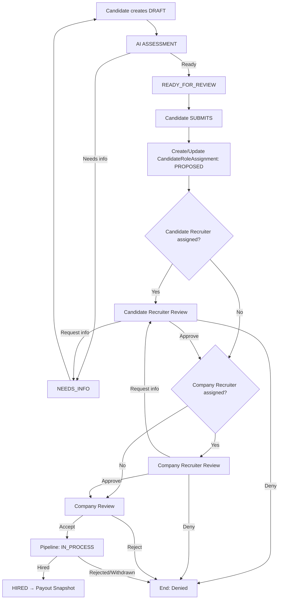

# Splits Network – Application Flow (Candidate → Hire)

This document defines the **application lifecycle** for Splits Network, including the **draft + AI assessment step**, recruiter gating, company gating, and how the flow adapts depending on which parties are present.

It is written to be used as:
- A reference for backend state machines
- A reference for UI routing and copy
- A reference for notifications and audit logging

---

## 1. Purpose

The application flow exists to:

- Let candidates express interest in a role (including “draft” intent)
- Run automated quality checks (AI assessment) before burdening humans
- Route applications through the correct representatives (candidate recruiter and/or company recruiter) when applicable
- Preserve a complete audit trail of decisions and transitions
- Maintain alignment with platform economics:
  - Candidate Sourcer (Discovery) is tied to the **Candidate**, not the role
  - Company Sourcer (BD) is tied to the **Company**, not the role
  - Closer/Specs/Client are determined per deal

---

## 2. Definitions

### Entities (core)
- **Candidate**
  - May have a **CandidateSourcerID** (Discovery)
- **Company**
  - May have a **CompanySourcerID** (BD)
- **Role**
  - Posted by a company
- **Application**
  - Candidate’s expression of interest in a role (draft → submitted)
- **CandidateRoleAssignment (CRA)**
  - The authoritative per-role “deal record” once the application becomes real
  - Tracks who is representing whom for this role and the state of the deal

### Parties / representatives
- **Candidate Recruiter (Closer)**
  - Recruiter representing the candidate for a role
- **Company Recruiter (Client / Hiring Facilitator)**
  - Recruiter representing the company for a role
- **Direct Company**
  - Company is acting directly without a company recruiter

### AI Assessment
- An automated evaluation that uses:
  - Candidate resume/profile
  - Role requirements
- Produces:
  - Match score
  - Gaps (missing info)
  - Recommendation (proceed / needs info / do not proceed)
- AI assessment is **assistive**:
  - It can route, nudge, and suggest
  - It cannot “hire” or “reject” on behalf of the company

---

## 3. State Model

### 3.1 Application states (candidate-level)
- `DRAFT`
- `ASSESSING`
- `READY_FOR_REVIEW`
- `NEEDS_INFO`
- `WITHDRAWN`
- `SUBMITTED` (becomes/creates CRA)
- `REJECTED` (rejected before becoming CRA)
- `ARCHIVED`

### 3.2 CRA states (deal-level)
These are the states used after the deal becomes “real” (submitted for consideration):

- `PROPOSED` (created but not yet accepted by required gate)
- `UNDER_REVIEW` (actively being evaluated by candidate recruiter and/or company recruiter and/or company)
- `SUBMITTED_TO_COMPANY`
- `IN_PROCESS` (interviews, stages)
- `OFFER`
- `HIRED`
- `REJECTED`
- `WITHDRAWN`

> Note: Interview-stage granularity can live in ATS pipeline stages; CRA state is the “outer shell” state.

---

## 4. Routing Rules (Who sees what next)

At the moment the application is **READY_FOR_REVIEW**, determine routing:

### 4.1 Determine candidate-side representation
- If candidate has an **active candidate recruiter assignment** for this role → Candidate Recruiter gate exists
- Else → Candidate is “direct”

### 4.2 Determine company-side representation
- If role has an assigned **company recruiter** → Company Recruiter gate exists
- Else → Company is “direct”

### 4.3 Routing outcomes
| Candidate Recruiter | Company Recruiter | Routing |
|---|---|---|
| No | No | Candidate → Company |
| No | Yes | Candidate → Company Recruiter → Company |
| Yes | No | Candidate → Candidate Recruiter → Company |
| Yes | Yes | Candidate → Candidate Recruiter → Company Recruiter → Company |

---

## 5. Canonical Flow (Happy Path)

### Step 1: Candidate creates Draft
- Candidate selects role and creates an application in `DRAFT`

UI copy guidance:
- “Start your application” (avoid “submit” until it’s submitted)
- “You can finish later.”

### Step 2: AI Assessment
- Candidate triggers assessment (or auto-runs on draft save)
- Application transitions: `DRAFT` → `ASSESSING` → `READY_FOR_REVIEW` or `NEEDS_INFO`

If `NEEDS_INFO`:
- Show targeted prompts (missing skills, missing resume, missing availability, etc.)
- Candidate can update and re-run assessment

### Step 3: Submit
- Candidate clicks submit
- Application transitions to `SUBMITTED`
- System creates (or upgrades) a **CandidateRoleAssignment**:
  - CRA created as `PROPOSED` and routed to the correct gate(s)

### Step 4: Gate review(s)
Depending on routing:

- Candidate recruiter review (if present)
- Company recruiter review (if present)
- Company review

Each gate produces an action:
- Approve → passes forward
- Request info → returns to candidate / candidate recruiter
- Deny → ends flow with reason

### Step 5: Company pipeline
If the company approves:
- CRA transitions to `IN_PROCESS`
- ATS stages progress (interviews, etc.)
- Final outcomes:
  - `HIRED` → triggers payout snapshot + payout (Phase 3+)
  - `REJECTED` / `WITHDRAWN`

---

## 6. Gate Actions (Approve / Deny / Request Info)

### 6.1 Candidate recruiter gate
Allowed actions:
- Approve & forward
- Deny
- Request info (to candidate)

When info is requested:
- CRA stays `UNDER_REVIEW`
- Application view for candidate displays required actions
- Candidate recruiter can re-approve after info supplied

### 6.2 Company recruiter gate
Allowed actions:
- Approve & forward to company
- Deny (to candidate recruiter if present; else to candidate)

### 6.3 Company gate
Allowed actions:
- Accept into pipeline (interview)
- Reject
- Request info (optional, routed back through company recruiter if present)

---

## 7. Notifications (Side effects, not branches)

Notifications are emitted as events; UI consumes events.

Minimum events:
- `application.draft.created`
- `application.assessment.completed`
- `application.info.requested`
- `application.submitted`
- `application.denied`
- `application.forwarded`
- `application.accepted_to_pipeline`
- `application.withdrawn`

Notification delivery:
- Email via Resend
- In-app notification center
- Optional SMS later

---

## 8. Mermaid Diagram

