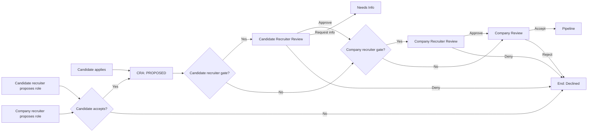

# Splits Network – Proposal Flow (Who Proposes to Whom)

This document defines **proposal mechanics** in Splits Network. A “proposal” is the act of forwarding a candidate (or candidate application) toward consideration for a role.

---

## 1. Purpose
- Allow multiple entry points into the deal system
- Route proposals through correct representatives
- Make accept/deny decisions explicit and logged
- Produce a single deal record per candidate-role: **CandidateRoleAssignment (CRA)**

---

## 2. Proposal Types (Entry Points)

### 2.1 Candidate-initiated proposal
Candidate applies to a role (direct or via recruiter).

### 2.2 Recruiter-initiated proposal
Candidate recruiter proposes a role to a candidate. Candidate must accept.

### 2.3 Company-initiated proposal
Company recruiter proposes role to candidate. Candidate acceptance creates a draft application that routes normally.

All entry points converge into the same routing rules.

---

## 3. Canonical Routing (Representation matrix)

| Candidate Recruiter | Company Recruiter | Routing |
|---|---|---|
| No | No | Candidate → Company |
| No | Yes | Candidate → Company Recruiter → Company |
| Yes | No | Candidate → Candidate Recruiter → Company |
| Yes | Yes | Candidate → Candidate Recruiter → Company Recruiter → Company |

---

## 4. Proposal Lifecycle (Deal-level)

Proposals live on the CRA. Suggested states:
- `PROPOSED`
- `AWAITING_CANDIDATE`
- `AWAITING_CANDIDATE_RECRUITER`
- `AWAITING_COMPANY_RECRUITER`
- `AWAITING_COMPANY`
- `SUBMITTED_TO_COMPANY`
- `REJECTED`
- `WITHDRAWN`

---

## 5. Actions & Permissions

### Candidate
- Accept / decline proposal
- Withdraw application

### Candidate recruiter
- Propose role to candidate
- Approve/deny candidate submission (if gate exists)
- Request info from candidate

### Company recruiter
- Approve/deny inbound proposals
- Request info (to candidate recruiter if exists)
- Forward to company

### Company
- Accept into pipeline
- Reject
- Request info (optional)

---

## 6. Single Active Deal Record Rule
Enforce one active CRA per candidate-role pair; update rather than duplicate.

---

## 7. Mermaid Diagram

