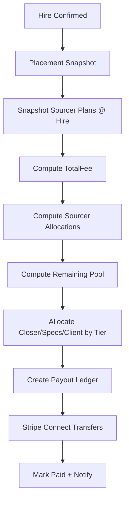

# Splits Network – Payout Flow (Hybrid Sourcer Incentive)

This document defines payout mechanics for Splits Network with the agreed **hybrid sourcer model**:

- Base sourcer rate = **6%**
- Tier bonus = **+2% (Pro)**, **+4% (Partner)**
- Sourcer rate is **snapshotted at time of hire**
- No retroactive changes

---

## 1. Roles in the Distribution Model

- Candidate Recruiter (Closer)
- Job Poster (Specs)
- Hiring Facilitator (Client)
- Business Sourcer (Company Sourcer / BD)
- Candidate Sourcer (Discovery)
- Platform remainder

---

## 2. Hybrid Sourcer Rule

### Candidate Sourcer
- Free: 6%
- Pro: 8%
- Partner: 10%

### Business Sourcer
- Free: 6%
- Pro: 8%
- Partner: 10%

Snapshot at `HIRED`:
- plan + rate stored on placement snapshot

---

## 3. Calculation Steps

1. Determine `TotalFee`
2. Compute sourcer allocations
3. Compute `Remaining`
4. Allocate closer/specs/client by tier
5. Platform remainder = Remaining - allocated
6. Split closer allocation if multiple closers
7. Create immutable payout ledger entries
8. Execute payouts via Stripe Connect (if enabled)

---

## 4. Mermaid Diagram

