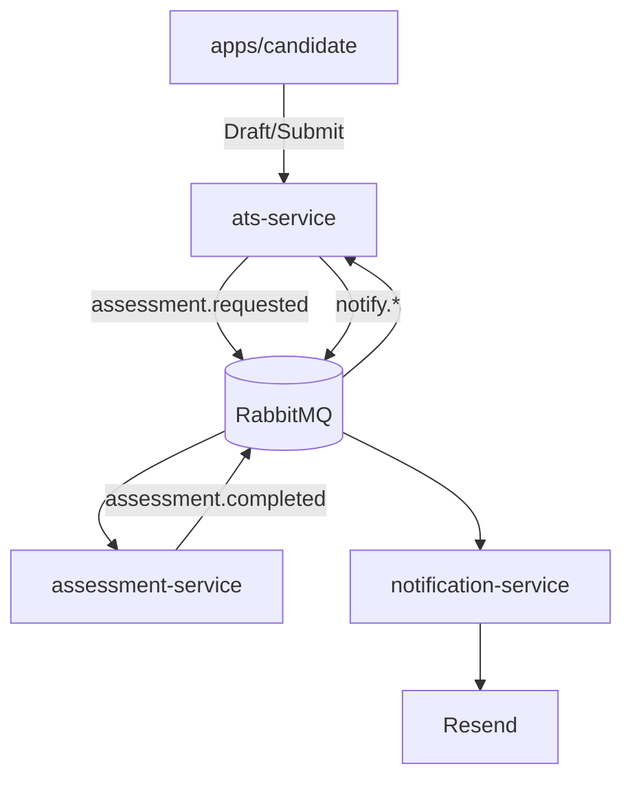
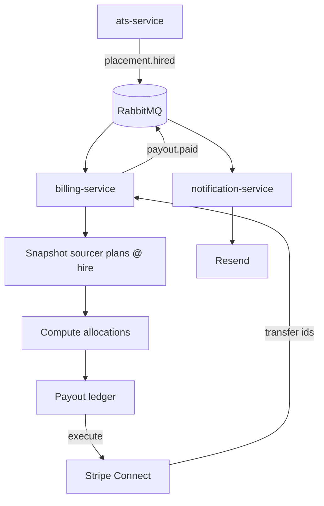

# Splits Network – Architecture (Including Diagrams)

Covers services and event flows for:
- Draft application + AI assessment
- Proposal routing
- Payout snapshot + Stripe payouts
- Notifications via Resend

---

## 1. Components
- Next.js apps: marketing, portal, candidate
- Fastify services: ats, network, billing, notifications, assessment (optional)
- Supabase Postgres
- RabbitMQ events
- Redis caches/counters
- Clerk auth
- Stripe subscriptions + Connect payouts
- Resend email

---

## 2. Diagram – Application & Assessment

---

## 3. Diagram – Payout Snapshot & Execution

